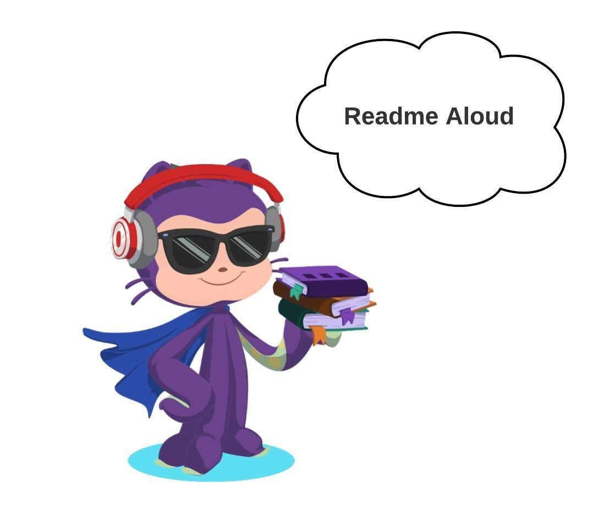
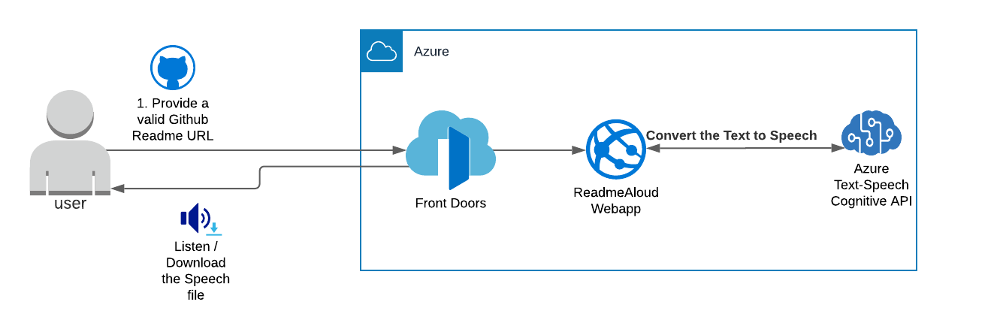

# ReadMeAloud

A simple tool to provide an easy and efficient way to understand open-source projects for everyone especially visually impaired or sight-impaired friends

# Architecutre 

Read the detailed article from 

[Dev Community Post]()